# ArcGIS JS 4.30 SDK Feature Table typing bug

There are a few interrelated issues with the typing and documentation of the `FeatureTable` and its properties when adding a feature table widget to a web app in Angular with TypeScript, using the npm version of the 4.30 SDK. The documentation contains ambiguous and incomplete descriptions of some properties and the TypeScript typing for the 4.30 SDK does not work as expected compared with the 4.30 CDN.

This repo contains a simple Angular application with a web map and a feature table illustrating these issues. For comparison, [this codepen](https://codepen.io/dlovett/pen/ExBWOqy) contains the same layers and imports.

1. A screenshot in the `Feature Table` [documentation](https://developers.arcgis.com/javascript/latest/api-reference/esri-widgets-FeatureTable.html#VisibleElements) suggests that the type for `VisibleElements` should include the property `layerDropdown`. However, `layerDropdown` is not included in the type's properties.

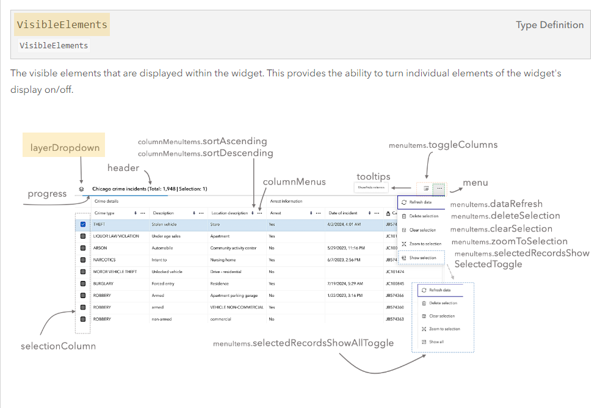

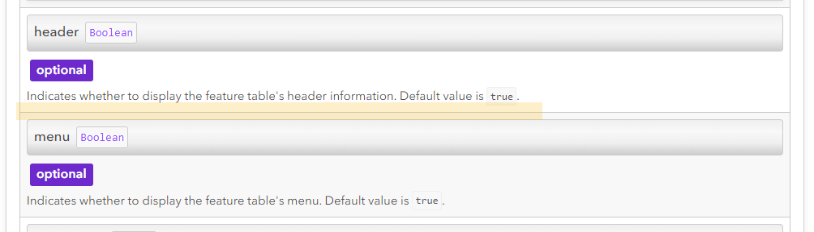

2. When trying to set this property on a `FeatureTable` object in an Angular application, TypeScript does not recognize this as a valid property. However, this property is listed when accessing the object through a console log.

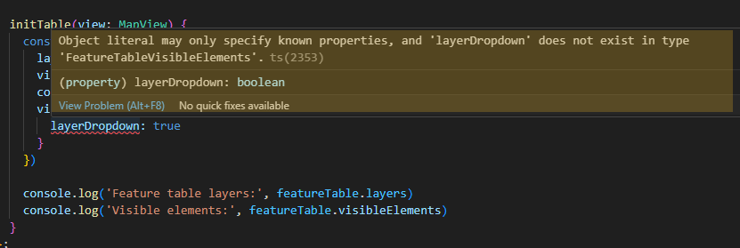

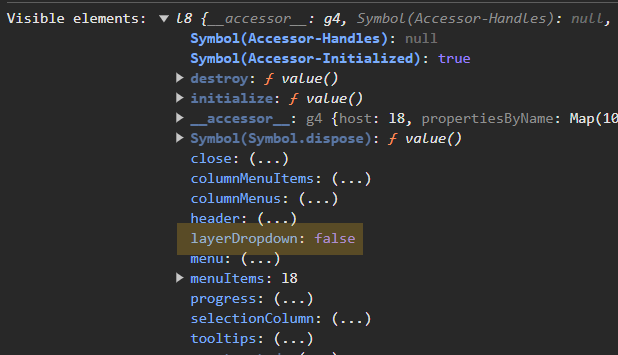

3. The usage of the `layerDropdown` property works as expected when using a simplified web app with the 4.30 CDN.

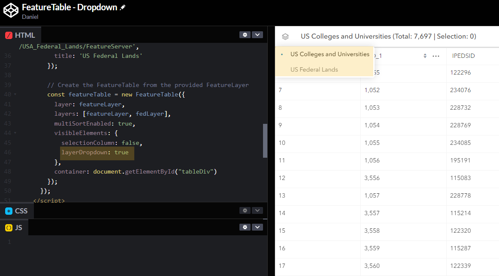

4. The [documentation](https://developers.arcgis.com/javascript/latest/api-reference/esri-widgets-FeatureTable.html#layers) is conflicting regarding whether the developer should declare a value for the array of layers contained in the table. The property is listed as readonly, but the description suggests that it can be manually set. The description suggests the table will show all supported layers, but this is unclear. The documentation should more clearly explain this property. The word "typically" is not helpful to developers; instead, the "default" value should be explained. Also, if a user can set this value, the `readonly` tag should be removed; if not, the reference to a user setting this value should be removed.

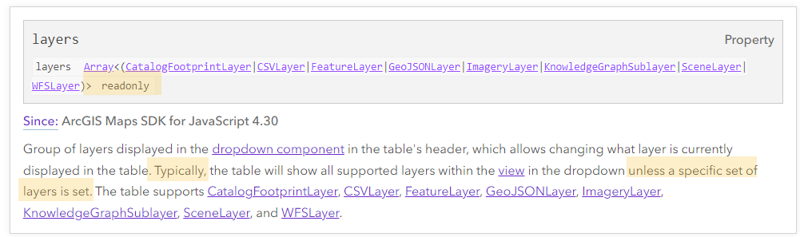

5. When the `view` property is set on a `FeatureTable` object in an Angular application, the table does not automatically set the layers property to contain all of that view's supported layers.

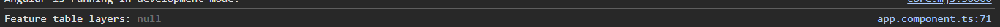

6. When attempting to set the `layers` property with an array of layers on the `FeatureTable` object in an Angular application, TypeScript does not recognize this as a valid property. However this property is listed when accessing the object through a console log.

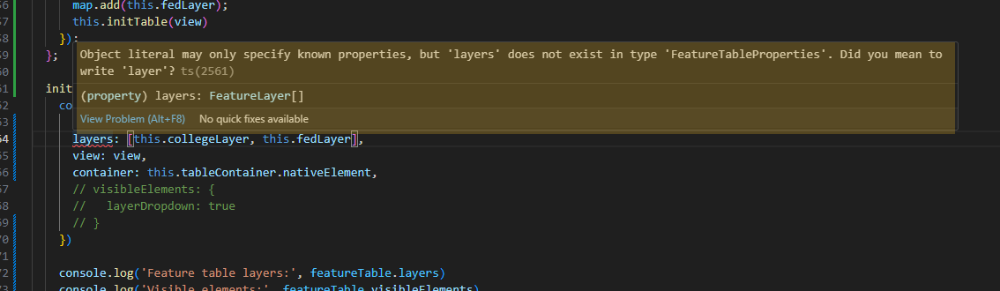

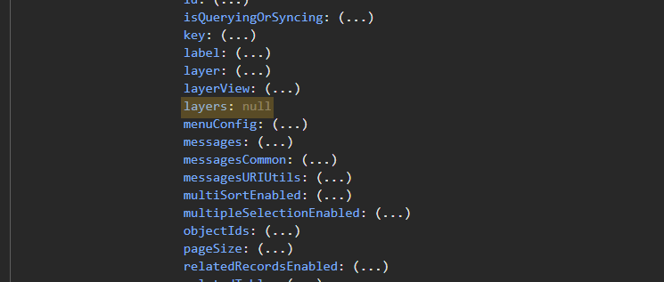

7. The usage of the `layers` property works as expected when using a simplified web app with the 4.30 CDN.

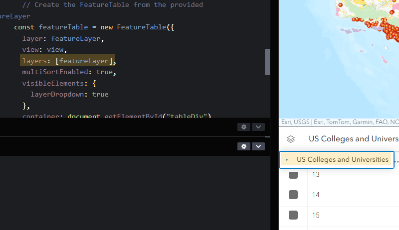

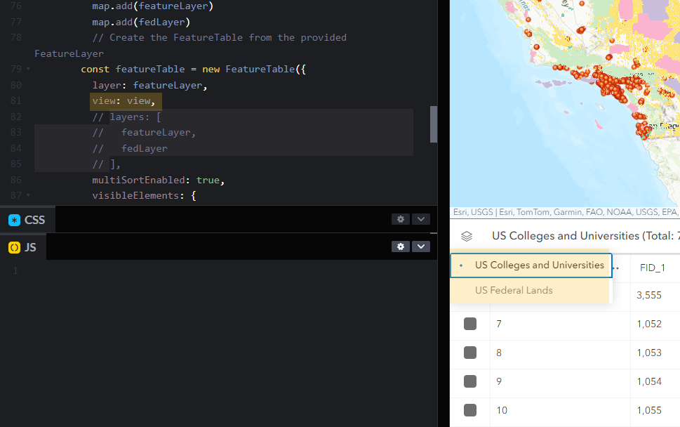